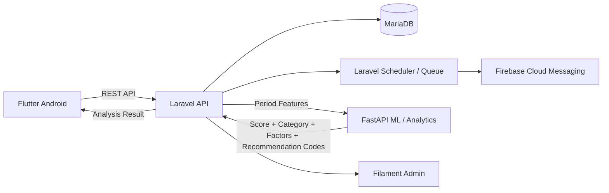
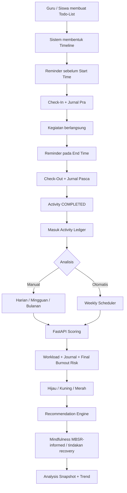

# MindfulEdu

> **Activity-first wellbeing monitoring system** untuk guru dan siswa berbasis **todo-list kegiatan, check-in/check-out, jurnal, Activity Ledger, Burnout Risk Analysis, dan rekomendasi mindfulness MBSR-informed / prinsip Kabat-Zinn**.

**BRD Version:** 2.2  
**Status:** Draft untuk Validasi Stakeholder  
**Platform:** Android + Web Admin + ML/Analytics Service

---

## Ringkasan Sistem

MindfulEdu tidak mengasumsikan jadwal harian guru maupun siswa. Pengguna terlebih dahulu mendaftarkan aktivitasnya sendiri seperti **todo-list**. Setiap kegiatan kemudian diperlakukan sebagai satu **unit transaksi aktivitas** yang memiliki jadwal, reminder, check-in, check-out, jurnal, durasi aktual, dan histori.

Seluruh transaksi aktivitas masuk ke **Activity Ledger**. Data inilah yang menjadi dasar untuk:

- analisis manual **harian, mingguan, atau bulanan**;
- analisis **mingguan otomatis** oleh sistem;
- perhitungan workload berbobot dari **TPH, TAH, dan Intensity Factor**;
- pembentukan **Journal Score**;
- perhitungan **Final Burnout Risk Score**;
- klasifikasi **Hijau / Kuning / Merah**;
- rekomendasi tindakan dan latihan mindfulness yang sesuai.

> **Catatan penting:** skor yang dihasilkan sistem adalah **indikator risiko/monitoring**, bukan diagnosis klinis burnout. Formula, threshold, bobot, instrumen, dan rekomendasi production harus divalidasi oleh Tim Psikologi/SME.

---

## Technology Stack

| Layer | Technology | Fungsi |
| --- | --- | --- |
| Android Frontend | **Flutter (Dart)** | Todo-list, timeline, check-in/out, jurnal, trigger analisis, tren, hasil dan rekomendasi |
| Core Backend/API | **Laravel** | Auth, RBAC, Activity Ledger, journal, scheduler, queue, orchestration |
| Admin Dashboard | **Laravel + Filament** | User/role, kategori kegiatan, Intensity Factor, threshold, konten mindfulness, monitoring |
| ML/Analytics | **FastAPI (Python)** | Feature engineering, scoring, data sufficiency, klasifikasi risiko, dominant factors, recommendation code |
| Database | **MariaDB** | Transactional data, ledger, journal, configuration, snapshot analisis |
| Push Notification | **Firebase Cloud Messaging** | Reminder check-in, check-out, dan hasil analisis |
| Scheduler/Queue | **Laravel Scheduler + Queue** | Reminder dinamis dan automatic weekly analysis |

### Arsitektur Integrasi



> Flutter tidak memanggil FastAPI secara langsung. Laravel tetap menjadi **application orchestration layer** dan **source of truth** agar auth, audit trail, business rules, dan histori snapshot tetap terpusat.

---

## Core Business Flow



---

## Formula Inti Burnout Risk MVP

### 1. Input

- **TPH — Total Planned Hours**: durasi kegiatan yang direncanakan.
- **TAH — Total Actual Hours**: durasi aktual dari check-in sampai check-out.
- **IF — Intensity Factor**: bobot tuntutan kegiatan.
- **Max Daily Capacity**: kapasitas harian acuan.
- **Journal Score**: skor kondisi subjektif pasca kegiatan.

Contoh IF awal:

| Aktivitas | IF |
| --- | ---: |
| Mengajar Matematika / aktivitas intensitas tinggi | 1.5 |
| Aktivitas normal | 1.0 |
| Istirahat / recovery | 0.5 |

> IF harus configurable dan versioned melalui Filament Admin.

### 2. Weighted Hours

```text
WPH = Σ(TPH_i × IF_i)
WAH = Σ(TAH_i × IF_i)
```

### 3. Daily Workload Score

```text
Daily Workload Score =
Σ(TAH_i × IF_i) / Max Daily Capacity × 100%
```

Nilai dapat lebih dari 100%. Nilai di atas 100% berarti workload berbobot aktual melebihi kapasitas acuan.

### 4. Weekly Workload Score

```text
Weekly Workload Score =
Σ WAH minggu / Σ Daily Capacity hari aktif × 100%
```

Denominator **tidak otomatis 7 hari**. Sistem memakai kapasitas hari aktif yang dikonfigurasi.

### 5. Monthly Workload Score

```text
Monthly Workload Score =
Σ WAH bulan / Σ Daily Capacity hari aktif × 100%
```

### 6. Planned vs Actual Variance

```text
Workload Variance (%) =
((WAH - WPH) / WPH) × 100%
```

Jika `WPH = 0`, variance tidak dihitung.

### 7. Journal Score Prototype

```text
Journal Score =
(0.35 × FatigueNorm) +
(0.35 × StressNorm) +
(0.20 × EffortNorm) +
(0.10 × RecoveryNeedNorm)
```

### 8. Final Burnout Risk Score Prototype

Raw workload tetap disimpan walaupun >100%, tetapi komponen workload untuk final risk dinormalisasi:

```text
Workload Risk Component = MIN(100, Period Workload Score)

Final Burnout Risk Score =
(0.60 × Workload Risk Component) +
(0.40 × Journal Score)
```

> Bobot **60% workload + 40% journal** masih baseline prototype dan wajib divalidasi.

### Contoh

Jika:

- Max Daily Capacity = 8 jam
- Weighted Actual Hours = 7.25 jam
- Journal Score = 70

Maka:

```text
Daily Workload Score = 7.25 / 8 × 100% = 90.63%

Final Burnout Risk Score =
(0.60 × 90.63) + (0.40 × 70)
= 82.38
```

Hasil tersebut dapat masuk kategori prototype **MERAH**, tergantung threshold aktif pada `scoring_version`.

---

## Prinsip Interpretasi

- **Banyak kegiatan ≠ otomatis burnout.**
- Workload >100% ≠ otomatis burnout merah.
- Workload adalah salah satu faktor risiko.
- Journal Score memberi konteks kondisi subjektif.
- Data sufficiency harus dicek sebelum kategori dikeluarkan.
- Kategori harus menyimpan `scoring_version`, `model_version`, dan `threshold_version`.
- Kategori warna adalah **risk monitoring**, bukan diagnosis.

---


| Prinsip Utama — Sistem tidak mengasumsikan jadwal pengguna. Guru dan siswa terlebih dahulu mendaftarkan kegiatan hariannya seperti todo-list. Setiap kegiatan menjadi satu unit data yang memiliki jadwal, check-in, check-out, jurnal, dan histori. Analisis burnout dilakukan setelah data aktivitas terkumpul, bukan pada saat check-in. |
| --- |

## 1. Kontrol Dokumen

| Atribut | Nilai |
| --- | --- |
| Nama Dokumen | Business Requirements Document – MindfulEdu |
| Versi | 2.2 |
| Tanggal | 27 Agustus 2026 |
| Status | Draft untuk Validasi Stakeholder |
| Perubahan Utama | Activity-first / todo-list dan Activity Ledger; Flutter Android, Laravel + Filament Admin, FastAPI Python; penambahan workload berbobot TPH/TAH/Intensity Factor, Journal Score, dan Final Burnout Risk Score. |
| Analisis Burnout | Manual sesuai periode pilihan pengguna; otomatis secara mingguan oleh sistem. |
| Intervensi | Rekomendasi mindfulness MBSR-informed / berprinsip Kabat-Zinn berdasarkan hasil analisis. |

### 1.1 Riwayat Revisi

| Versi | Perubahan |
| --- | --- |
| 1.0 | Check-in sebelum kelas → scoring burnout → mindfulness → check-out → jurnal → tren. |
| 2.0 | Todo-list kegiatan sebagai sumber jadwal; reminder dinamis; check-in/check-out per kegiatan; jurnal per kegiatan; burnout tidak dihitung saat check-in; manual analysis + weekly automatic analysis; rekomendasi berdasarkan hasil periode. |
| 2.1 | Menetapkan stack: Flutter sebagai frontend Android, Laravel + Filament untuk backend/admin, FastAPI Python sebagai ML service; menambahkan tingkat burnout terkonfigurasi dan rekomendasi tindakan berbasis prinsip Kabat-Zinn/MBSR-informed. |
| 2.2 | Menambahkan Weighted Planned/Actual Hours, Daily/Weekly/Monthly Workload Score, Workload Variance, Journal Score, Final Burnout Risk Score, serta kontrak FastAPI workload + jurnal. |

### 1.2 Acuan Penyusunan

Kebutuhan stakeholder terbaru: kegiatan harus didaftarkan sendiri oleh guru dan siswa karena sistem tidak mengetahui aktivitas aktual mereka setiap hari.

Konteks MindfulEdu saat ini sudah memiliki logbook, sesi mindfulness, reminder, dashboard guru, dan status monitoring hijau/kuning/merah.

Program PKM menekankan pengelolaan stres/burnout guru, jurnal/refleksi, monitoring berkelanjutan, serta penerapan mindfulness di lingkungan pembelajaran.

Praktik mindfulness yang direkomendasikan mengacu pada praktik formal dan informal yang lazim dalam MBSR: breath/attention awareness, body scan, sitting meditation, mindful movement, walking meditation, dan mindful awareness dalam aktivitas sehari-hari. Aplikasi menggunakan versi micro-practice yang diadaptasi, bukan menggantikan program MBSR 8 minggu.


---

# Detail Business Requirements


## 2. Ringkasan Eksekutif

MindfulEdu versi ini menggunakan pendekatan activity-first. Pengguna terlebih dahulu menyusun todo-list kegiatan aktualnya. Sistem kemudian memperlakukan setiap kegiatan sebagai satu unit transaksi aktivitas yang memiliki waktu mulai, waktu selesai, status, reminder, check-in, check-out, jurnal, dan data kesejahteraan. Dengan cara ini, seluruh hasil monitoring dapat ditelusuri kembali ke aktivitas yang benar-benar dijalani pengguna.

Konsepnya menyerupai ledger dalam sistem akuntansi: transaksi tidak langsung disimpulkan satu per satu, tetapi dicatat secara konsisten lalu direkap pada suatu periode. Dalam MindfulEdu, satu kegiatan adalah “transaksi aktivitas”, sedangkan Activity Ledger adalah kumpulan transaksi aktivitas yang menjadi dasar analisis harian, mingguan, atau bulanan.

Kategori Hijau, Kuning, dan Merah tidak ditentukan ketika pengguna baru melakukan check-in. Check-in dan check-out berfungsi mengumpulkan data konteks sebelum dan sesudah kegiatan. Burnout Analysis Engine baru berjalan ketika pengguna memicu analisis manual atau ketika scheduler menjalankan analisis mingguan otomatis.

### 2.1 Business Outcome

| ID | Outcome Bisnis | Indikator |
| --- | --- | --- |
| BO-01 | Mendapatkan peta kegiatan aktual guru dan siswa tanpa bergantung pada jadwal yang diasumsikan sistem. | Persentase pengguna yang membuat todo-list harian dan aktivitas yang memiliki jadwal valid. |
| BO-02 | Membentuk data wellbeing yang terkait langsung dengan aktivitas. | Persentase aktivitas completed yang memiliki check-in, check-out, dan jurnal. |
| BO-03 | Menghasilkan analisis burnout berbasis data periode, bukan mood sesaat. | Analisis menampilkan periode, jumlah data, sumber input, score/category, dan confidence/data sufficiency. |
| BO-04 | Menyediakan intervensi mindfulness yang actionable. | Setiap hasil kategori menghasilkan rekomendasi untuk guru/siswa sesuai role dan tingkat risiko. |
| BO-05 | Membentuk tren longitudinal. | Pengguna dapat melihat tren hari, minggu, bulan dan riwayat analisis otomatis mingguan. |

## 3. Konsep Bisnis Inti: Activity Ledger

Activity Ledger adalah catatan kronologis seluruh kegiatan pengguna beserta perubahan status dan data wellbeing terkait. Ledger menjadi single source of truth untuk analisis periodik.

| Analogi akuntansi — Todo-list = daftar transaksi yang direncanakan. Check-in/check-out = realisasi transaksi. Jurnal = narasi/keterangan transaksi. Activity Ledger = buku besar aktivitas. Burnout Analysis = proses rekap/closing periode untuk membaca pola dari transaksi yang telah terkumpul. |
| --- |

### 3.1 Unit Transaksi Aktivitas

| Field | Contoh | Keterangan |
| --- | --- | --- |
| Activity ID | ACT-20260827-001 | ID unik. |
| User | Guru A / Siswa B | Pemilik aktivitas. |
| Role Context | Teacher / Student | Menentukan template todo dan recommendation. |
| Judul Kegiatan | Mengajar Matematika Kelas 5A | Diisi pengguna. |
| Kategori | Mengajar / Rapat / Administrasi / Belajar / Tugas / Lainnya | Untuk analitik beban aktivitas. |
| Start–End | 07:00–08:00 | Menjadi dasar scheduler reminder. |
| Status | PLANNED → ... → COMPLETED | Lifecycle aktivitas. |
| Check-In | Kondisi sebelum aktivitas | Terhubung ke Activity ID. |
| Check-Out | Kondisi setelah aktivitas | Terhubung ke Activity ID. |
| Journal | Refleksi pra/pasca aktivitas | Terhubung ke Activity ID. |
| Analysis Inclusion | Included / Excluded + reason | Menentukan apakah aktivitas masuk perhitungan periode. |
| TPH / Planned Hours | 1,0 jam | Durasi rencana dari start_time–end_time. |
| Intensity Factor (IF) | Matematika=1,5; Istirahat=0,5 | Bobot relatif aktivitas, configurable dan versioned per kategori/role. |
| TAH / Actual Hours | 1,2 jam | Durasi aktual dari check-in/check-out; sumber realisasi workload. |

## 4. Aktor dan Peran

| Aktor | Tanggung Jawab | Akses Utama |
| --- | --- | --- |
| Guru | Mendaftarkan kegiatan mengajar/non-mengajar, mengisi check-in/out, jurnal, memicu analisis, mengikuti mindfulness. | Data pribadi, todo-list, ledger, analisis dan rekomendasi pribadi. |
| Siswa | Mendaftarkan kegiatan belajar, tugas, ujian, atau aktivitas sekolah yang relevan; melakukan check-in/out dan jurnal sederhana. | Data pribadi, todo-list, ledger, analisis/rekomendasi sesuai kebijakan usia/sekolah. |
| Admin Program | Mengelola user, kategori aktivitas, konfigurasi reminder, konten mindfulness, report agregat. | Konfigurasi dan agregat sesuai RBAC. |
| Tim Psikologi / SME | Menetapkan instrumen, formula, threshold, aturan rekomendasi dan eskalasi. | Konfigurasi klinis/psikologis yang disahkan. |
| PIC Sekolah | Tindak lanjut jika ada kebijakan dukungan dan persetujuan. | Minimum necessary information, bukan jurnal pribadi default. |
| System Scheduler | Menjalankan reminder dinamis dan analisis mingguan otomatis. | Job terjadwal dan audit log. |

## 5. Alur Bisnis End-to-End

Gambar 1. Alur bisnis baru MindfulEdu berbasis todo-list dan Activity Ledger.

### 5.1 Urutan Proses Utama

Pada awal hari atau sebelum aktivitas dimulai, guru/siswa membuat todo-list kegiatan beserta waktu mulai dan selesai.

Sistem memvalidasi bentrok waktu, lalu membentuk timeline dan menjadwalkan notifikasi.

Sebelum waktu mulai, sistem mengirim reminder untuk melakukan check-in. Check-in dapat sekaligus memuat jurnal pra-kegiatan singkat.

Pada waktu selesai atau beberapa menit sesudahnya, sistem mengirim reminder check-out.

Pengguna melakukan check-out dan mengisi jurnal pasca-kegiatan. Aktivitas kemudian menjadi completed.

Setiap aktivitas yang selesai masuk ke Activity Ledger dan dapat dilihat sebagai histori harian.

Pengguna dapat menekan Analisis Burnout kapan saja dan memilih periode Harian, Mingguan, atau Bulanan.

Terpisah dari trigger manual, sistem menjalankan analisis mingguan otomatis pada jadwal yang dikonfigurasi.

Burnout Analysis Engine menghitung score/risk menggunakan formula dan instrumen yang telah divalidasi, lalu mengeluarkan Hijau/Kuning/Merah.

Recommendation Engine mengembalikan saran mindfulness yang sesuai role, kategori, histori, dan ketersediaan waktu.

Hasil disimpan sebagai Analysis Snapshot sehingga tren dari periode ke periode dapat dibandingkan.

## 6. Todo-List dan Penjadwalan Aktivitas

### 6.1 Guru

Guru tidak diasumsikan selalu hanya memiliki kelas. Todo-list harus mendukung kegiatan mengajar maupun non-mengajar agar beban harian lebih representatif.

| Kategori Contoh | Contoh Kegiatan |
| --- | --- |
| Mengajar | Matematika 5A, Bahasa Indonesia 6B |
| Persiapan | Menyiapkan bahan ajar, membuat soal |
| Administrasi | Input nilai, laporan, absensi |
| Rapat | Rapat guru, koordinasi orang tua |
| Evaluasi | Mengoreksi tugas/ujian |
| Pengembangan | Pelatihan, workshop |
| Lainnya | Aktivitas sekolah lain yang relevan |

### 6.2 Siswa

Siswa juga memiliki todo-list sendiri agar sistem tidak mengasumsikan kegiatan belajar mereka. Template siswa dibuat lebih sederhana dan sesuai kebijakan sekolah.

| Kategori Contoh | Contoh Kegiatan |
| --- | --- |
| Kelas | Matematika, IPA, Bahasa Indonesia |
| Belajar Mandiri | Review materi, membaca |
| Tugas | Mengerjakan PR/proyek |
| Ujian/Kuis | Ulangan harian, ujian |
| Ekstrakurikuler | Olahraga, seni, organisasi |
| Lainnya | Aktivitas sekolah/pembelajaran lain |

### 6.3 Aturan Todo-List

Setiap activity minimal memiliki judul, tanggal, waktu mulai, waktu selesai, dan kategori.

Pengguna boleh menambah, mengubah, atau membatalkan kegiatan sebelum activity dikunci oleh status tertentu.

Sistem memberi warning jika jadwal overlap, tetapi tidak selalu memblokir karena pengguna dapat memiliki kegiatan paralel yang valid.

Kegiatan dapat dibuat berulang (recurring) untuk mengurangi beban input, tetapi pengguna tetap dapat mengubah kejadian tertentu.

Kegiatan yang dibatalkan tidak dihitung sebagai completed workload; histori pembatalan tetap disimpan untuk audit.

Pengguna dapat menandai kegiatan tidak relevan untuk analisis dengan reason yang tersimpan.

## 7. Reminder Engine

Reminder diturunkan langsung dari waktu pada todo-list. Karena jadwal berasal dari pengguna, perubahan jadwal harus langsung melakukan reschedule notifikasi.

| Trigger | Default Logic | Aksi |
| --- | --- | --- |
| Pre-Activity | X menit sebelum start_time (configurable) | Push notification: “Kegiatan akan dimulai. Yuk check-in.” |
| Start Time Passed | Jika belum check-in setelah toleransi | Reminder kedua / status CHECK_IN_PENDING. |
| End Time | Pada end_time atau X menit setelahnya | Push notification: “Kegiatan selesai. Jangan lupa check-out.” |
| Checkout Overdue | Jika belum checkout setelah grace period | Reminder lanjutan dengan cooldown. |
| Weekly Analysis | Jadwal mingguan configurable | System menghasilkan Weekly Burnout Analysis otomatis. |
| Recommendation Follow-up | Jika user memulai mindfulness | Reminder completion/re-check bila diperlukan. |

## 8. Lifecycle Aktivitas

Gambar 2. Lifecycle satu transaksi aktivitas.

| Status | Arti | Transisi Utama |
| --- | --- | --- |
| PLANNED | Aktivitas sudah terdaftar di todo-list. | → CHECK_IN_PENDING |
| CHECK_IN_PENDING | Masuk jendela check-in, belum diisi. | → CHECKED_IN / tetap pending |
| CHECKED_IN | Check-in dan jurnal pra tersimpan. | → IN_PROGRESS |
| IN_PROGRESS | Aktivitas sedang berlangsung. | → CHECK_OUT_PENDING |
| CHECK_OUT_PENDING | Waktu selesai tercapai, check-out belum diisi. | → CHECKED_OUT |
| CHECKED_OUT | Check-out selesai. | → JOURNAL_PENDING / COMPLETED |
| JOURNAL_PENDING | Jurnal pasca wajib belum lengkap. | → COMPLETED |
| COMPLETED | Aktivitas lengkap dan eligible untuk ledger/analysis. | Terminal |
| CANCELLED | Aktivitas dibatalkan. | Terminal; tidak dihitung workload completed. |

## 9. Check-In dan Jurnal Pra-Kegiatan

Check-in tidak mengeluarkan kategori burnout. Tujuannya adalah mengambil baseline singkat untuk activity tersebut dan menambah data ke ledger.

| Komponen | Contoh Input | Wajib? |
| --- | --- | --- |
| Mood/Kondisi | Sangat baik – sangat buruk / ikon emosi | Ya |
| Energi/Kelelahan | Skala 0–10 | Ya |
| Stres/Tegang | Skala 0–10 | Ya |
| Fokus/Kesiapan | Skala 0–10 | Ya |
| Jurnal Pra | “Apa yang paling membutuhkan perhatian saya pada kegiatan ini?” | Singkat; configurable |
| Harapan/Niat | “Satu hal yang ingin saya jaga selama kegiatan.” | Opsional |
| Timestamp | Otomatis dari server | Ya |

## 10. Check-Out dan Jurnal Pasca-Kegiatan

Check-out mengukur kondisi setelah kegiatan untuk melihat perubahan dari baseline dan mencatat pengalaman yang dapat menjelaskan pola pada analisis.

| Komponen | Contoh Input | Kegunaan |
| --- | --- | --- |
| Energi/Kelelahan Post | Skala 0–10 | Delta pre-post. |
| Stres Post | Skala 0–10 | Delta pre-post. |
| Ketenangan/Fokus Post | Skala 0–10 | Perubahan kondisi. |
| Perceived Effort | Ringan – sangat berat | Beban subjektif activity. |
| Jurnal Pasca | Apa yang terjadi? Apa yang paling menguras/menolong? | Contextual signal. |
| Perlu Recovery? | Ya/Tidak | Input ke recommendation engine. |
| Timestamp & Duration Actual | Otomatis/konfirmasi user | Bandingkan planned vs actual. |

## 11. Burnout Analysis Engine

| Perubahan Logic — Burnout tidak dihitung setiap kali check-in atau check-out. Engine hanya berjalan pada Manual Analysis atau Weekly Automatic Analysis. Dengan demikian, warna kategori merepresentasikan hasil agregasi periode yang dipilih, bukan satu mood sesaat. |
| --- |

### 11.1 Manual Analysis

Pengguna dapat menekan tombol “Analisis Burnout” kapan saja. Sistem meminta periode analisis:

Harian – menggunakan kegiatan pada tanggal yang dipilih.

Mingguan – menggunakan kegiatan pada rentang minggu yang dipilih.

Bulanan – menggunakan kegiatan pada bulan yang dipilih.

Sebelum menghitung, sistem mengecek Data Sufficiency. Jika jumlah activity/check-in/check-out atau respons instrumen belum memenuhi syarat minimal, hasil harus menyatakan “data belum cukup” dan bukan memaksakan kategori.

### 11.2 Automatic Weekly Analysis

Sistem menjalankan batch analysis secara otomatis satu kali setiap minggu pada waktu yang dapat dikonfigurasi. Analisis menggunakan data minggu tersebut dan menghasilkan Weekly Analysis Snapshot. Jika pengguna juga pernah melakukan analisis manual untuk periode yang sama, kedua hasil disimpan dengan source berbeda agar audit trail tetap jelas.

### 11.3 Input yang Dapat Digunakan

| Kelompok Input | Contoh | Catatan |
| --- | --- | --- |
| Activity Load | Jumlah activity, total durasi, kategori activity, activity density, kegiatan malam/beruntun. | Indikator workload; bukan burnout score tunggal. |
| Pre/Post Wellbeing | Energi, kelelahan, stres, fokus, calmness, delta. | Menangkap pola perubahan saat menjalani aktivitas. |
| Journal Signals | Tag pemicu, recovery, positive/negative reflection. | Gunakan structured tags untuk analitik; teks bebas tidak wajib dianalisis otomatis. |
| Validated Burnout Instrument | Item/score dari instrumen yang disahkan SME. | Komponen utama jika kategori disebut risiko burnout. |
| History | Frekuensi yellow/red sebelumnya, recovery pattern. | Untuk contextual recommendation, bukan diagnosis. |

### 11.4 Model Perhitungan Workload dan Burnout Risk

Model MVP menggunakan pendekatan hybrid rule-based: beban aktivitas dihitung dari realisasi waktu dan bobot intensitas, lalu digabungkan dengan Journal Score. FastAPI menjadi scoring service. Model menghasilkan indikator risiko/monitoring, bukan diagnosis klinis burnout.

#### 11.4.1 Definisi Input Perhitungan

| Parameter | Definisi | Sumber Data |
| --- | --- | --- |
| TPH – Total Planned Hours | Durasi aktivitas yang direncanakan. Per aktivitas: TPH_i = planned_end − planned_start. | Todo-list / activities |
| TAH – Total Actual Hours | Durasi aktivitas aktual. Per aktivitas: TAH_i = checkout_time − checkin_time. | Check-in / Check-out |
| IF – Intensity Factor | Bobot tuntutan aktivitas. Contoh awal: MTK 1,5; normal 1,0; istirahat 0,5. | Master kategori di Filament |
| Max Daily Capacity | Kapasitas harian acuan pengguna, misalnya 8 jam/hari; configurable. | Admin configuration / profile |
| Journal Score | Skor 0–100 dari kelelahan, stres, perceived effort, dan kebutuhan recovery. | Post-journal |

#### 11.4.2 Weighted Planned dan Actual Hours

Perhitungan dilakukan per aktivitas agar Intensity Factor mengikuti karakter kegiatan.

```text
Weighted Planned Hours (WPH) = Σ(TPH_i × IF_i)
```

```text
Weighted Actual Hours (WAH) = Σ(TAH_i × IF_i)
```

#### 11.4.3 Daily Workload Score

Daily Workload Score menunjukkan proporsi kapasitas harian yang terpakai setelah mempertimbangkan intensitas aktivitas.

```text
Daily Workload Score = (Σ(TAH_i × IF_i) / Max Daily Capacity) × 100%
```

Nilai dapat melebihi 100%. Angka >100% berarti weighted actual workload melampaui kapasitas harian acuan.

#### 11.4.4 Weekly dan Monthly Workload Score

Denominator mingguan tidak selalu 7 × Max Daily Capacity karena hari aktif dapat berbeda. Sistem menggunakan kapasitas periode yang dikonfigurasi.

```text
Weekly Workload Score = (Σ WAH minggu / Σ Daily Capacity hari aktif) × 100%
```

```text
Monthly Workload Score = (Σ WAH bulan / Σ Daily Capacity hari aktif) × 100%
```

Contoh 5 hari kerja × 8 jam menghasilkan Weekly Capacity = 40 jam kapasitas. Hari libur/izin dapat dikeluarkan sesuai kalender.

#### 11.4.5 Planned vs Actual Variance

TPH digunakan untuk melihat deviasi antara beban rencana dan realisasi.

```text
Workload Variance (%) = ((WAH − WPH) / WPH) × 100%
```

Jika WPH = 0, variance tidak dihitung dan sistem menandai planning data tidak tersedia.

#### 11.4.6 Journal Score

Workload tidak cukup untuk menggambarkan burnout risk. Jurnal pasca-kegiatan menghasilkan Journal Score 0–100. Formula prototype:

| Komponen Journal | Normalisasi Prototype | Bobot Prototype |
| --- | --- | --- |
| Fatigue / Kelelahan Post | skala 0–10 × 10 | 35% |
| Stress Post | skala 0–10 × 10 | 35% |
| Perceived Effort | dikonversi ke 0–100 | 20% |
| Recovery Need | Tidak=0; Ya=100 | 10% |

```text
Journal Score = (0,35 × FatigueNorm) + (0,35 × StressNorm) + (0,20 × EffortNorm) + (0,10 × RecoveryNeedNorm)
```

Bobot adalah prototype MVP dan harus configurable/versioned di Filament serta divalidasi Tim Psikologi/SME.

#### 11.4.7 Final Burnout Risk Score

FastAPI menggabungkan workload dan jurnal menjadi skor final 0–100. Raw Workload Score tetap disimpan walaupun >100%, sedangkan komponen workload untuk final risk dinormalisasi maksimum 100.

```text
Workload Risk Component = MIN(100, Period Workload Score)
```

```text
Final Burnout Risk Score = (0,60 × Workload Risk Component) + (0,40 × Journal Score)
```

Bobot 60% workload + 40% journal adalah baseline prototype. Instrumen burnout tervalidasi dapat ditambahkan sebagai feature/calibration layer setelah disahkan Tim Psikologi.

#### 11.4.8 Interpretasi Workload vs Burnout Risk

| Jenis Output | Rentang Prototype | Makna |
| --- | --- | --- |
| Workload Capacity Status | <80% / 80–100% / >100% | Terkendali / mendekati kapasitas / melebihi kapasitas. Bukan kategori burnout. |
| Final Burnout Risk Category | 0–39 / 40–69 / 70–100 | Hijau / Kuning / Merah berdasarkan Final Burnout Risk Score. |

Pemisahan ini mencegah salah interpretasi: workload 105% tidak otomatis berarti burnout. Sistem tetap mempertimbangkan Journal Score dan data sufficiency.

#### 11.4.9 Contoh Perhitungan Harian

| Kegiatan | TPH | TAH | IF | TAH × IF |
| --- | --- | --- | --- | --- |
| Mengajar Matematika | 2,0 | 2,5 | 1,5 | 3,75 |
| Mengajar Seni | 1,0 | 1,0 | 1,0 | 1,00 |
| Administrasi | 2,0 | 2,0 | 1,0 | 2,00 |
| Istirahat | 1,0 | 1,0 | 0,5 | 0,50 |
| TOTAL | 6,0 | 6,5 | — | 7,25 |

Jika Max Daily Capacity = 8 jam, Daily Workload Score = 7,25 / 8 × 100% = 90,63%. Jika Journal Score = 70, Final Burnout Risk Score = (0,60 × 90,63) + (0,40 × 70) = 82,38 → kategori prototype MERAH.

Contoh hanya demonstrasi formula dan integrasi sistem, bukan cutoff klinis final.

Formula tidak boleh hardcoded tanpa persetujuan tim psikologi.

Jumlah kegiatan yang banyak tidak otomatis berarti burnout. Activity load adalah salah satu konteks; pengguna dapat memiliki banyak kegiatan tetapi tetap memiliki wellbeing baik.

Kategori risiko wajib mencatat scoring_version agar hasil historis dapat ditelusuri.

Hasil minimal memuat: periode, jumlah activity eligible, completeness, score, category, ringkasan faktor, rekomendasi, generated_at, dan analysis_source.

Jika sistem menggunakan instrumen berbeda untuk guru dan siswa, scoring profile dan threshold harus dipisahkan per role/populasi.

Status warna adalah indikator monitoring/risiko, bukan diagnosis klinis.

### 11.5 Placeholder Category

| Kategori | Makna Sistem | Catatan |
| --- | --- | --- |
| HIJAU | Risiko rendah / kondisi relatif stabil pada periode yang dianalisis. | Threshold final ditetapkan SME. |
| KUNING | Perlu perhatian dan recovery lebih terstruktur. | Rekomendasi mindfulness lebih aktif + monitoring. |
| MERAH | Risiko tinggi / pola perlu tindak lanjut lebih serius sesuai kebijakan. | Mindfulness bukan satu-satunya tindakan; dapat memerlukan dukungan manusia/rujukan. |

### 11.6 Tingkat Burnout dan Keluaran Model

Burnout Analysis Engine menghasilkan normalized risk score 0–100 sebagai keluaran teknis model. Untuk prototype, pemetaan warna di bawah dapat digunakan agar integrasi frontend, dashboard, dan ML dapat diuji. Nilai ini bukan cutoff klinis; threshold production wajib dapat dikonfigurasi dan disahkan oleh Tim Psikologi/SME.

| Status / Skor Prototype | Tingkat | Interpretasi Sistem | Aksi Utama |
| --- | --- | --- | --- |
| DATA TIDAK CUKUP | — | Activity/jurnal/assessment belum memenuhi minimum data sufficiency. | Tidak memberikan warna burnout. Sistem meminta pengguna melengkapi data dan menjalankan analisis ulang. |
| 0–39 | HIJAU | Risiko rendah / kondisi relatif stabil pada periode. | Maintenance mindfulness; pertahankan recovery dan pantau tren. |
| 40–69 | KUNING | Risiko sedang / terdapat pola kelelahan atau stres yang perlu perhatian. | Recovery terstruktur + latihan mindfulness lebih aktif + evaluasi beban kegiatan. |
| 70–100 | MERAH | Risiko tinggi / pola berulang memerlukan perhatian lebih serius. | Mindfulness sebagai dukungan, kurangi beban bila memungkinkan, lakukan human follow-up/rujukan sesuai kebijakan. |

Catatan implementasi ML: score, threshold_version, model_version, data_sufficiency, dominant_factors, confidence, category, dan recommendation_codes harus ikut disimpan pada Analysis Snapshot. Dengan demikian, perubahan model di masa depan tidak mengubah histori hasil lama.

## 12. Recommendation Engine – Kabat-Zinn / MBSR-Informed

MindfulEdu sebaiknya menyebut konten sebagai “MBSR-informed micro-practices” atau “latihan mindfulness berbasis prinsip Kabat-Zinn”, bukan mengklaim bahwa latihan 3–10 menit di aplikasi merupakan program MBSR penuh. MBSR asli merupakan program terstruktur yang mencakup latihan formal dan informal seperti body scan, sitting meditation, mindful movement, dan walking meditation.

### 12.1 Mapping Rekomendasi untuk Guru

| Kategori | Tujuan | Rekomendasi Contoh | Durasi Aplikasi |
| --- | --- | --- | --- |
| Hijau | Maintenance awareness dan transisi antarkegiatan. | Mindful breathing; 1-minute pause; mindful transition; awareness saat minum/makan/berjalan. | 1–3 menit |
| Kuning | Menurunkan reaktivitas dan memberi recovery lebih terstruktur. | Breath-focused sitting; short body scan; mindful movement; mindful walking; STOP/pause yang diselaraskan prinsip mindfulness. | 5–10 menit |
| Merah | Mendorong jeda, recovery, dan dukungan yang lebih kuat. | Guided body scan; sitting meditation; gentle mindful movement; recovery plan; ajakan menghubungi PIC/profesional bila rule terpenuhi. | 10–20 menit atau sesuai konten SME |

### 12.2 Mapping Rekomendasi untuk Siswa

Untuk siswa, latihan harus lebih singkat, bahasa sederhana, dan sesuai usia. Kategori pada siswa tetap diperlakukan sebagai monitoring kesejahteraan/kelelahan belajar sesuai instrumen yang disetujui, bukan label klinis.

| Kategori | Rekomendasi Contoh | Catatan |
| --- | --- | --- |
| Hijau | 1–2 menit sadar napas; mindful listening; mindful transition sebelum belajar. | Bisa dilakukan individual/kelas. |
| Kuning | Short body awareness; guided breathing; mindful walking singkat; jeda layar/tugas terstruktur. | Sertakan refleksi sederhana. |
| Merah | Latihan singkat yang aman + ajakan bicara dengan guru/wali/BK/PIC sesuai kebijakan. | Jangan hanya memberikan meditasi; perlu jalur dukungan manusia bila diperlukan. |

### 12.3 Faktor Pemilihan Recommendation

Role pengguna: teacher/student.

Kategori hasil: hijau/kuning/merah.

Waktu tersedia sampai activity berikutnya.

Preferensi format: audio, teks, haptic/timer.

Riwayat latihan yang pernah efektif menurut re-check pengguna.

Keterbatasan fisik/aksesibilitas; mindful movement harus memiliki opsi duduk.

Persistent risk rule dan kebutuhan dukungan non-digital.

### 12.4 Decision Matrix: Tingkat Burnout → Apa yang Dilakukan

Recommendation Engine tidak hanya menampilkan nama latihan, tetapi mengembalikan langkah yang dapat dilakukan segera, rekomendasi mindfulness, dan tindak lanjut. Rekomendasi bersifat MBSR-informed berbasis praktik yang diasosiasikan dengan pendekatan Jon Kabat-Zinn seperti awareness of breathing, body scan, sitting meditation, mindful movement, walking meditation, serta informal mindfulness dalam aktivitas sehari-hari. Kategori rekomendasi menggunakan Final Burnout Risk Score, sedangkan raw Workload Score ditampilkan sebagai konteks kapasitas. Dominant factor menentukan penekanan tindakan: overload waktu, aktivitas intensitas tinggi beruntun, kelelahan/stres jurnal, atau recovery rendah.

| Kategori | Untuk Guru – Mindfulness | Untuk Guru – Tindakan Operasional | Untuk Siswa / Kelas |
| --- | --- | --- | --- |
| HIJAU | Awareness of breathing 1–3 menit; mindful walking/transition; informal mindfulness saat minum, makan, atau berjalan. | Pertahankan jeda antaraktivitas, recovery yang sudah efektif, dan review tren mingguan. | 1–2 menit sadar napas, mindful listening, atau transisi tenang sebelum belajar. |
| KUNING | Body scan singkat 5–10 menit; sitting meditation fokus napas; mindful movement; mindful walking. | Tambahkan recovery break, kurangi multitasking, identifikasi kegiatan paling menguras, pertimbangkan penyesuaian todo-list, lalu re-check pada analisis berikutnya. | Guided breathing/body awareness singkat, mindful stretch, jeda tugas/layar, refleksi sederhana dengan bahasa sesuai usia. |
| MERAH | Guided body scan atau sitting meditation 10–20 menit; gentle mindful movement. Mindfulness tidak dijadikan satu-satunya tindakan. | Prioritaskan recovery; evaluasi beban kegiatan non-esensial; hubungi PIC/dukungan manusia sesuai kebijakan. Jika merah berulang, sistem memunculkan escalation rule dan anjuran bantuan profesional. | Berikan latihan singkat yang aman dan menenangkan; hentikan tuntutan tambahan bila memungkinkan; arahkan bicara dengan guru/wali/BK/PIC. Jangan memberi label diagnosis kepada siswa. |

### 12.5 Contoh Keluaran Recommendation Engine

| Field | Contoh |
| --- | --- |
| burnout_score | 64 |
| category | KUNING |
| dominant_factors | Kelelahan meningkat setelah 4 aktivitas beruntun; recovery rendah; stres pasca-kegiatan konsisten tinggi. |
| recommended_practice | Short Body Scan – 7 menit |
| recommended_action | Sisihkan jeda 10 menit sebelum aktivitas berikutnya; hindari multitasking; evaluasi satu aktivitas yang dapat dijadwalkan ulang. |
| follow_up | Jalankan analisis ulang pada akhir minggu atau setelah data tambahan tersedia. |
| weighted_planned_hours | 38 |
| weighted_actual_hours | 42 |
| workload_score_raw | 105% |
| journal_score | 74/100 |
| final_burnout_risk_score | 89,6/100 |

## 13. Trend dan Analitik

Trend dashboard dibangun dari Activity Ledger dan Analysis Snapshot. Dashboard tidak harus menghitung ulang seluruh histori setiap dibuka; sistem dapat menggunakan agregasi periodik yang dapat direkonsiliasi ke raw activity.

| View | Isi Utama |
| --- | --- |
| Harian | Jumlah planned/completed activity, total durasi, pre-post delta per activity, jurnal ringkas, hasil manual harian jika ada. |
| Mingguan | Workload per hari, completion check-in/out, tren energi/stres, hasil weekly auto-analysis, rekomendasi dan completion. |
| Bulanan | Perbandingan antar minggu, frekuensi kategori, pola aktivitas yang sering diikuti kelelahan tinggi, consistency mindfulness. |
| Activity Detail | Timeline satu activity: planned → reminder → check-in → checkout → journal → inclusion in analysis. |

### 13.1 Metric Utama

| Metric | Definisi |
| --- | --- |
| Activity Completion Rate | Completed activity / planned activity. |
| Check-In Completion Rate | Activity eligible dengan check-in / activity eligible. |
| Check-Out Completion Rate | Activity eligible dengan checkout / activity yang berakhir. |
| Journal Completion Rate | Activity completed dengan jurnal yang diwajibkan / activity completed. |
| Total Activity Duration | Akumulasi actual duration pada periode. |
| Pre-Post Fatigue Delta | Fatigue post - fatigue pre per activity dan rerata periode. |
| Weekly Risk Category | Kategori dari weekly auto-analysis. |
| Mindfulness Completion | Rekomendasi yang dijalankan / rekomendasi yang diterima. |
| Weighted Planned Hours (WPH) | Σ(TPH × IF) pada periode. |
| Weighted Actual Hours (WAH) | Σ(TAH × IF) pada periode. |
| Workload Capacity Utilization | WAH / period capacity × 100%; dapat >100%. |
| Workload Variance | (WAH − WPH) / WPH × 100%, jika WPH > 0. |
| Journal Score | Skor 0–100 dari jurnal terstruktur sesuai scoring_version. |
| Final Burnout Risk Score | Skor 0–100 hasil kombinasi workload + jurnal pada prototype. |

## 14. Functional Requirements

| ID | Module | Requirement | Priority |
| --- | --- | --- | --- |
| FR-ACT-001 | Activity | Guru/siswa dapat membuat todo activity dengan judul, kategori, tanggal, start time, end time. | Must |
| FR-ACT-002 | Activity | Pengguna dapat edit, cancel, duplicate, dan membuat recurring activity dengan audit perubahan. | Must |
| FR-ACT-003 | Activity | Sistem harus menampilkan timeline/list harian dan jumlah activity planned/completed. | Must |
| FR-ACT-004 | Activity | Sistem harus memberi warning jadwal overlap. | Must |
| FR-REM-001 | Reminder | Sistem menjadwalkan reminder check-in berdasarkan start_time activity. | Must |
| FR-REM-002 | Reminder | Sistem menjadwalkan reminder check-out berdasarkan end_time activity. | Must |
| FR-REM-003 | Reminder | Perubahan jadwal activity harus reschedule/cancel notification terkait. | Must |
| FR-CI-001 | Check-In | Check-in harus terikat ke Activity ID dan menyimpan baseline wellbeing + timestamp. | Must |
| FR-CI-002 | Check-In | Check-in dapat memuat jurnal pra-kegiatan singkat. | Must |
| FR-CO-001 | Check-Out | Checkout harus terikat ke Activity ID dan menyimpan post wellbeing + actual duration. | Must |
| FR-JRN-001 | Journal | Jurnal pra dan pasca activity disimpan terpisah namun terhubung ke activity yang sama. | Must |
| FR-LED-001 | Ledger | Setiap activity dan event pentingnya harus tercatat pada Activity Ledger. | Must |
| FR-ANA-001 | Analysis | Pengguna dapat trigger analisis manual dan memilih harian/mingguan/bulanan. | Must |
| FR-ANA-002 | Analysis | Sistem mengecek data sufficiency sebelum memberikan kategori. | Must |
| FR-ANA-003 | Analysis | Sistem menjalankan burnout analysis otomatis setiap minggu berdasarkan schedule configuration. | Must |
| FR-ANA-004 | Analysis | Hasil analysis menyimpan source MANUAL/AUTO_WEEKLY, periode, score, category, version, faktor ringkas. | Must |
| FR-ANA-005 | Analysis | Burnout category tidak boleh dihitung otomatis pada setiap check-in. | Must |
| FR-REC-001 | Recommendation | Sistem memetakan hasil kategori ke rekomendasi mindfulness MBSR-informed sesuai role. | Must |
| FR-REC-002 | Recommendation | Rekomendasi mempertimbangkan waktu tersedia sebelum activity berikutnya. | Must |
| FR-REC-003 | Recommendation | Sistem menyimpan start/completion dan re-check latihan mindfulness. | Must |
| FR-TRD-001 | Trend | Dashboard menyediakan view harian, mingguan, bulanan dan drill-down activity. | Must |
| FR-TRD-002 | Trend | Trend dapat membedakan hasil manual vs weekly automatic analysis. | Must |
| FR-ADM-001 | Admin | Admin dapat mengelola kategori activity, reminder window, content, scoring version dan recommendation mapping sesuai kewenangan. | Must |
| FR-PRV-001 | Privacy | Jurnal pribadi tidak terbuka kepada admin secara default; akses mengikuti RBAC dan consent/kebijakan. | Must |
| FR-TECH-001 | Architecture | Aplikasi Android pengguna harus dibangun dengan Flutter dan mengakses business API melalui Laravel. | Must |
| FR-TECH-002 | Admin | Dashboard administrasi harus menggunakan Filament pada Laravel untuk konfigurasi dan monitoring. | Must |
| FR-ML-001 | ML | Burnout scoring dan recommendation inference harus tersedia melalui FastAPI Python service. | Must |
| FR-ML-002 | ML | Flutter tidak boleh memanggil FastAPI secara langsung; Laravel menjadi orchestration layer dan source of truth. | Must |
| FR-ML-003 | ML | ML response harus memuat score, category, data sufficiency/confidence, dominant factors, recommendation codes, model_version dan scoring_version. | Must |
| FR-ML-004 | ML | Manual analysis dan automatic weekly analysis harus menggunakan scoring service/versi model yang sama untuk periode yang ekuivalen. | Must |
| FR-ANA-006 | Analysis | Sistem menghitung WPH = Σ(TPH × IF) dan WAH = Σ(TAH × IF) untuk periode analisis. | Must |
| FR-ANA-007 | Analysis | Sistem menghitung Daily/Weekly/Monthly Workload Score menggunakan kapasitas periode terkonfigurasi. | Must |
| FR-ANA-008 | Analysis | Sistem menghitung Workload Variance planned vs actual jika WPH > 0. | Should |
| FR-ANA-009 | Analysis | Sistem menghasilkan Journal Score 0–100 dari jurnal terstruktur sesuai scoring_version. | Must |
| FR-ANA-010 | Analysis | Sistem menghasilkan Final Burnout Risk Score dan kategori dari workload + Journal Score. | Must |
| FR-ADM-002 | Admin | Filament mengelola IF, Max Daily Capacity, bobot Journal Score, bobot final risk, threshold, dan effective version. | Must |

## 15. Business Rules

| ID | Rule |
| --- | --- |
| BR-001 | Activity wajib terdaftar sebelum reminder dapat dijadwalkan. |
| BR-002 | Reminder selalu mengikuti waktu activity terbaru; schedule lama dibatalkan jika activity diubah. |
| BR-003 | Satu activity maksimal memiliki satu check-in aktif dan satu check-out final; koreksi harus tercatat sebagai revision. |
| BR-004 | Check-in tidak menghasilkan kategori burnout. |
| BR-005 | Checkout dan jurnal memperkaya ledger tetapi juga tidak otomatis menghasilkan kategori burnout per activity. |
| BR-006 | Manual Analysis hanya berjalan setelah pengguna memilih periode dan lolos data sufficiency. |
| BR-007 | Automatic Analysis berjalan mingguan pada scheduler yang dikonfigurasi. |
| BR-008 | Manual dan automatic result untuk periode sama disimpan sebagai dua snapshot; tidak saling overwrite. |
| BR-009 | Activity CANCELLED tidak dihitung sebagai completed workload. |
| BR-010 | Jumlah activity tidak dapat digunakan sendirian untuk menyimpulkan burnout. |
| BR-011 | Threshold warna dan formula harus versioned dan disetujui SME. |
| BR-012 | Kategori Merah tidak boleh otomatis digunakan untuk keputusan disipliner/kinerja. |
| BR-013 | Untuk red/persistent risk, recommendation dapat mencakup dukungan manusia sesuai consent dan policy. |
| BR-014 | Rekomendasi siswa harus age-appropriate dan tidak menggunakan bahasa diagnosis. |
| BR-015 | Setiap generated analysis harus dapat ditelusuri ke activity/data periode yang digunakan. |
| BR-016 | FastAPI hanya menerima data fitur/period payload yang diperlukan untuk analisis; Laravel tetap menjadi source of truth data pengguna. |
| BR-017 | Threshold Hijau/Kuning/Merah harus configurable dan versioned; prototype 0–39/40–69/70–100 tidak dianggap cutoff klinis final. |
| BR-018 | Jika data_sufficiency tidak memenuhi minimum, sistem mengembalikan DATA TIDAK CUKUP dan tidak memaksakan kategori warna. |
| BR-019 | Kategori MERAH berulang mengikuti persistent-risk/escalation rule dan tidak boleh hanya menghasilkan rekomendasi meditasi. |
| BR-020 | Hasil rekomendasi harus dapat ditelusuri ke recommendation_code dan content_version yang aktif saat Analysis Snapshot dibuat. |
| BR-021 | TPH berasal dari planned duration; TAH berasal dari check-in/check-out aktual yang valid. |
| BR-022 | IF berasal dari master kategori configurable dan versioned; perubahan IF tidak boleh mengubah snapshot historis. |
| BR-023 | Workload Score dihitung dari Σ(TAH × IF) / capacity periode, bukan hanya jumlah kegiatan. |
| BR-024 | Weekly capacity menggunakan hari aktif/kapasitas terkonfigurasi; tidak memaksa denominator 7 hari. |
| BR-025 | Raw Workload Score dapat >100%; Workload Risk Component dinormalisasi maksimum 100 pada formula final prototype. |
| BR-026 | Final Burnout Risk prototype = 60% Workload Risk Component + 40% Journal Score; bobot configurable/versioned. |
| BR-027 | Workload Capacity Status dan Final Burnout Risk Category adalah output berbeda. |

## 16. Notification Matrix

| Event | Target | Timing | Pesan/Aksi Sistem |
| --- | --- | --- | --- |
| Activity akan mulai | Pemilik activity | X menit sebelum start | Reminder check-in. |
| Check-in belum dilakukan | Pemilik activity | Setelah start + tolerance | Follow-up ringan; tidak spam. |
| Activity berakhir | Pemilik activity | Pada end / X menit sesudah | Reminder check-out. |
| Checkout overdue | Pemilik activity | Setelah grace period | Follow-up dengan cooldown. |
| Weekly analysis selesai | Pemilik user | Setelah job selesai | Tampilkan kategori + ringkasan + rekomendasi. |
| Manual analysis selesai | Pemilik user | Immediate | Tampilkan result snapshot. |
| Persistent risk | User/PIC sesuai rule | Sesuai policy & consent | Support/escalation, minimum necessary data. |

## 17. Data Model Konseptual

| Entity | Field Kunci / Relasi | Fungsi |
| --- | --- | --- |
| users | id, role, profile | Guru/siswa/admin. |
| activities | id, user_id, title, category_id, start_at, end_at, planned_hours, intensity_factor_version, status, recurrence_id | Todo/unit transaksi; planned duration dan referensi IF. |
| activity_events | activity_id, event_type, timestamp, metadata | Activity Ledger / audit lifecycle. |
| checkins | activity_id, wellbeing inputs, pre_journal_id, submitted_at | Baseline sebelum activity. |
| checkouts | activity_id, wellbeing inputs, actual_duration/actual_hours, submitted_at | Kondisi setelah activity dan sumber TAH. |
| journals | activity_id, phase PRE/POST, structured_tags, text, created_at | Refleksi terkait activity. |
| assessment_responses | user_id, instrument_version, period/context, answers | Respons instrumen terstandar. |
| analysis_runs | user_id, source, period_start/end, scoring_version, sufficiency, wph, wah, workload_score, journal_score, final_risk_score, category | Snapshot analisis manual/auto beserta komponen formula. |
| analysis_activity_links | analysis_run_id, activity_id | Traceability activity yang digunakan. |
| recommendations | analysis_run_id, target_role, tactic_id, reason, duration | Output recommendation engine. |
| mindfulness_sessions | user_id, recommendation_id, started_at, completed_at, recheck | Histori intervensi. |
| notifications | user_id, activity_id, type, schedule_at, sent_at, status | Reminder engine. |
| activity_intensity_config | category_id, role, intensity_factor, version, effective_from/to | Master IF versioned untuk workload. |

## 18. Technology Architecture & API / Service Mapping

| Service | Operasi Utama |
| --- | --- |
| Activity Service | create/update/cancel/list/timeline/recurring/complete |
| Reminder Scheduler | schedule/reschedule/cancel/send/pre-checkin/post-checkout/weekly-job |
| Check-In Service | submit/get/update-allowed |
| Check-Out Service | submit/get/update-allowed |
| Journal Service | submit pre/post/list by activity |
| Ledger Service | append event/get timeline/reconcile |
| Analysis Service | manual analyze/weekly auto analyze/get snapshots/data sufficiency |
| Recommendation Service | map category/role/context to mindfulness content |
| Trend Service | daily/weekly/monthly aggregate/drill-down |
| Admin Configuration | categories/reminder/scoring versions/recommendation matrix |

### 18.1 Technology Stack

Arsitektur MindfulEdu memisahkan transactional application layer dan ML/analytics layer. Flutter tidak mengakses model ML secara langsung. Semua request pengguna masuk melalui Laravel API agar autentikasi, otorisasi, audit trail, penyimpanan snapshot, dan business rule tetap terpusat.

| Layer | Technology | Tanggung Jawab |
| --- | --- | --- |
| Frontend Android | Flutter (Dart) | Todo-list/timeline, reminder UI, check-in, check-out, jurnal, trigger analisis manual, tren, dan tampilan hasil/rekomendasi. |
| Admin Dashboard | Laravel + Filament | Kelola user/role, kategori aktivitas, konten mindfulness, konfigurasi reminder, threshold/model version, monitoring weekly analysis, laporan agregat, dan audit. |
| Core Backend / API | Laravel | Authentication (Sanctum), activity ledger, journals, reminder orchestration, scheduler/queue, RBAC, penyimpanan data, dan pemanggilan ML service. |
| ML / Analytics Service | FastAPI (Python) | Feature preparation, model inference/scoring, data sufficiency, klasifikasi Hijau/Kuning/Merah, dominant factors, dan recommendation code selection. |
| Database | MariaDB | Transactional data, activity ledger, journal, configuration, analysis snapshot, dan recommendation history. |
| Scheduler / Queue | Laravel Scheduler + Queue | Reminder check-in/check-out dan trigger automatic weekly analysis. |
| Push Notification | Firebase Cloud Messaging (FCM) | Alarm/reminder ke perangkat Android untuk check-in, check-out, dan hasil weekly analysis. |

### 18.2 Alur Integrasi Flutter – Laravel – FastAPI

## 1. Guru/siswa membuat todo-list melalui aplikasi Flutter.

## 2. Flutter mengirim data ke Laravel API; Laravel menyimpan activity dan membentuk jadwal reminder.

## 3. Laravel Scheduler/Queue mengirim push notification check-in/check-out melalui FCM sesuai start_at dan end_at.

## 4. Check-in, check-out, dan jurnal dari Flutter disimpan oleh Laravel ke Activity Ledger/MariaDB.

## 5. Pada trigger manual atau scheduler mingguan, Laravel menyiapkan data periode yang eligible lalu memanggil FastAPI.

## 6. FastAPI melakukan feature engineering/model inference dan mengembalikan score, category, confidence/data sufficiency, dominant factors, dan recommendation_codes.

## 7. Laravel menyimpan hasil sebagai Analysis Snapshot dan mengirimkan hasil final ke Flutter. Filament menampilkan monitoring yang diizinkan oleh RBAC.

### 18.3 Kontrak FastAPI untuk ML Burnout

| Endpoint | Method | Fungsi |
| --- | --- | --- |
| /v1/burnout/analyze | POST | Analisis manual harian/mingguan/bulanan atau automatic weekly analysis. |
| /v1/burnout/model-info | GET | Mengembalikan model_version, scoring_version, dan metadata model aktif. |
| /v1/recommendations/resolve | POST | Opsional jika recommendation engine dipisahkan dari endpoint analyze. |
| /health | GET | Health check ML service untuk monitoring backend. |

Request minimum FastAPI memuat period_type, period capacity, activity features (TPH, TAH, IF), agregat jurnal terstruktur, dan scoring_version. Response minimum memuat data_sufficiency, weighted_planned_hours, weighted_actual_hours, workload_score_raw, workload_variance_pct, journal_score, final_burnout_risk_score, category, dominant_factors, recommendation_codes, model_version, dan scoring_version.

| Field FastAPI | Contoh | Keterangan |
| --- | --- | --- |
| weighted_planned_hours | 38.0 | Σ(TPH × IF) periode. |
| weighted_actual_hours | 42.0 | Σ(TAH × IF) periode. |
| workload_score_raw | 105.0 | WAH / period capacity × 100; boleh >100. |
| workload_variance_pct | 10.53 | Deviasi actual terhadap planned. |
| journal_score | 74.0 | Skor jurnal 0–100. |
| final_burnout_risk_score | 89.6 | Skor final 0–100 sesuai scoring_version. |
| category | MERAH | Kategori prototype dari final risk score. |
| dominant_factors | high workload; high fatigue | Faktor penjelas rekomendasi. |
| recommendation_codes | BODY_SCAN_10; RECOVERY_BREAK | Kode konten/tindakan. |

### 18.4 Pembagian Tanggung Jawab Sistem

| Komponen | Boleh Menghitung / Menentukan | Tidak Boleh Menjadi Tanggung Jawab Utama |
| --- | --- | --- |
| Flutter | Validasi UI sederhana dan tampilan hasil. | Menentukan score burnout/threshold secara lokal. |
| Laravel + Filament | Business rule, auth/RBAC, scheduling, audit, persist snapshot, konfigurasi model/rekomendasi. | Menjalankan training/inference ML berat di request web utama. |
| FastAPI Python | Feature engineering, model inference, klasifikasi risiko, dominant factors, recommendation code. | Mengelola autentikasi aplikasi utama atau menyimpan data transaksi sebagai source of truth. |

Catatan ML MVP: formula awal dapat dijalankan FastAPI sebagai deterministic/rule-based scoring yang transparan. Setelah dataset longitudinal dan label tervalidasi tersedia, service yang sama dapat di-upgrade menjadi supervised/hybrid ML tanpa mengubah arsitektur Flutter–Laravel.

## 19. Non-Functional Requirements

| ID | Kategori | Requirement | Priority |
| --- | --- | --- | --- |
| NFR-SEC-001 | Security | Seluruh production traffic melalui HTTPS; token/session dikelola aman. | Must |
| NFR-AUTH-001 | Authorization | RBAC diverifikasi pada backend. | Must |
| NFR-PRV-001 | Privacy | Jurnal dan assessment dianggap sensitif; minimum-necessary access. | Must |
| NFR-PERF-001 | Performance | Todo list dan check-in/out harus responsif pada koneksi mobile wajar. | Should |
| NFR-NOTIF-001 | Reliability | Reminder harus idempotent dan memiliki retry/status delivery. | Must |
| NFR-DAT-001 | Integrity | Activity lifecycle dan analysis snapshot harus konsisten dan auditable. | Must |
| NFR-TZ-001 | Timezone | Scheduler menggunakan timezone sekolah/user yang terkonfigurasi. | Must |
| NFR-ACC-001 | Accessibility | Konten mindfulness memiliki alternatif teks/audio dan opsi mindful movement duduk. | Should |
| NFR-OBS-001 | Observability | Weekly job, notification, scoring failure tercatat dan dapat dimonitor. | Should |

## 20. UAT / Acceptance Scenarios

| ID | Scenario | Condition | Expected Result |
| --- | --- | --- | --- |
| UAT-01 | Create Todo | Guru membuat Matematika 07:00–08:00. | Activity PLANNED tampil pada timeline dan reminder terjadwal. |
| UAT-02 | Pre Reminder | Waktu masuk jendela sebelum 07:00. | Push check-in dikirim sesuai konfigurasi. |
| UAT-03 | Check-In | Guru mengisi baseline dan jurnal pra. | Data menempel pada Activity ID; tidak ada kategori burnout yang dihitung. |
| UAT-04 | Checkout Reminder | Jam activity berakhir. | Reminder checkout dikirim; status pending jika belum isi. |
| UAT-05 | Complete Activity | Guru checkout dan jurnal pasca. | Activity COMPLETED; ledger menyimpan lifecycle dan pre/post. |
| UAT-06 | Manual Daily | Guru pilih analisis harian. | Engine mengecek sufficiency, lalu menyimpan snapshot manual. |
| UAT-07 | Manual Monthly | Guru pilih bulan tertentu. | Analisis memakai activity eligible pada bulan tersebut dan tampilkan traceability. |
| UAT-08 | Weekly Auto | Scheduler mencapai jadwal mingguan. | System menjalankan analisis otomatis dan mengirim hasil ke user. |
| UAT-09 | Same Period | Sudah ada manual weekly, kemudian auto weekly berjalan. | Dua snapshot disimpan; source berbeda; tidak overwrite. |
| UAT-10 | Insufficient Data | Data periode tidak cukup. | Sistem memberi status data belum cukup, bukan warna palsu. |
| UAT-11 | Recommendation Yellow | Analysis menghasilkan Kuning. | Recommendation engine mengembalikan micro-practice yang sesuai role/waktu. |
| UAT-12 | Student Flow | Siswa membuat todo, check-in/out dan analisis. | Template/rekomendasi lebih sederhana dan age-appropriate. |
| UAT-13 | Reschedule | Activity 07:00 diubah ke 09:00. | Reminder lama dibatalkan dan reminder baru dijadwalkan. |
| UAT-14 | Trend | User memiliki beberapa minggu data. | Dashboard menampilkan harian/mingguan/bulanan serta hasil weekly automatic. |
| UAT-15 | FastAPI Analyze | Laravel mengirim payload analisis mingguan valid ke FastAPI. | FastAPI mengembalikan score/category/factors/recommendation codes beserta model/scoring version dan Laravel menyimpan snapshot. |
| UAT-16 | Data Insufficient | Aktivitas/jurnal tidak memenuhi minimum. | Hasil DATA TIDAK CUKUP; tidak ada kategori Hijau/Kuning/Merah yang dipaksakan. |
| UAT-17 | Yellow Recommendation | Model mengembalikan KUNING. | Flutter menampilkan rekomendasi mindfulness + tindakan operasional + follow-up. |
| UAT-18 | Repeated Red | Pengguna memiliki MERAH berulang sesuai konfigurasi. | Sistem menjalankan escalation rule dan menampilkan dukungan manusia selain mindfulness. |
| UAT-19 | Admin ML Monitoring | Admin membuka Filament. | Admin dapat melihat status model/version, weekly job, konfigurasi threshold, dan library recommendation sesuai permission. |
| UAT-20 | Daily Weighted Workload | TAH dan IF tersedia untuk activity eligible. | Sistem menghasilkan WAH dan Daily Workload Score sesuai formula. |
| UAT-21 | Weekly Capacity | User aktif 5 hari dengan capacity 8 jam/hari. | Denominator weekly = 40, bukan otomatis 56. |
| UAT-22 | Intensity Factor | MTK IF 1,5 dan istirahat IF 0,5. | WAH memakai bobot per activity. |
| UAT-23 | Planned vs Actual | WPH > 0 dan WAH berbeda. | Workload Variance tersimpan pada snapshot. |
| UAT-24 | Journal Score | Post-journal lengkap. | FastAPI menghasilkan Journal Score 0–100 sesuai scoring_version. |
| UAT-25 | Final Risk | Workload Risk dan Journal Score tersedia. | Final score dihitung 60/40 dan kategori dipetakan dari final score. |
| UAT-26 | Raw Workload >100 | Weekly workload raw = 105%. | Raw tetap 105%; final component capped 100; UI tidak menyebut 105% sebagai burnout score. |

## 21. Risiko dan Mitigasi

| Risiko | Dampak | Mitigasi |
| --- | --- | --- |
| Todo-list tidak diisi | Sistem tidak mengetahui aktivitas aktual. | Recurring activity, copy previous day, template, quick-add, reminder perencanaan. |
| Notification fatigue | Pengguna mengabaikan reminder. | Configurable lead time, cooldown, digest, quiet hours. |
| Burnout disimpulkan dari jumlah aktivitas | Hasil menyesatkan. | Gunakan weighted workload (TAH × IF) + Journal Score; jumlah kegiatan hanya metric pendukung. Validasi formula dengan SME. |
| Jurnal terlalu panjang | Completion rendah. | Gunakan structured tags + satu pertanyaan pendek; teks bebas opsional. |
| Kategori merah dianggap diagnosis | Stigma/keputusan salah. | Gunakan bahasa risk monitoring, disclaimer, human support. |
| Micro-practice dianggap MBSR penuh | Klaim metodologis tidak tepat. | Label “MBSR-informed / prinsip Kabat-Zinn”; jelaskan bahwa program MBSR penuh lebih terstruktur. |
| Data siswa sensitif | Risiko privasi. | Consent, RBAC, age-appropriate UI, agregasi, retention policy. |
| Weekly job gagal | Analisis terlambat. | Retry, monitoring, audit job, manual rerun oleh admin berwenang. |

## 22. MVP dan Tahapan Implementasi

| Fase | Scope | Output |
| --- | --- | --- |
| Fase 1 – Activity Ledger MVP | Todo-list teacher/student, reminder start/end, check-in/out, pre/post journal, lifecycle, history. | Satu activity dapat berjalan end-to-end dan masuk ledger. |
| Fase 2 – Analysis | Manual day/week/month, data sufficiency, scoring version, category snapshot. | User dapat memicu analisis tanpa mengubah raw activity. |
| Fase 3 – Weekly Automation | Scheduler mingguan, notification result, trend dashboard. | Weekly burnout snapshot otomatis tersedia. |
| Fase 4 – Recommendation | MBSR-informed content mapping per role/category/context + re-check. | Hasil analisis langsung actionable. |
| Fase 5 – Program Monitoring | Admin aggregate, audit, export anonim, persistent-risk rule. | Program dapat dievaluasi tanpa membuka detail pribadi secara default. |

## 23. Open Decisions yang Harus Divalidasi

| No | Keputusan | Owner |
| --- | --- | --- |
| 1 | Instrumen burnout untuk guru dan apakah siswa memakai instrumen kesejahteraan/academic exhaustion yang berbeda. | Tim Psikologi |
| 2 | Formula scoring, threshold Hijau/Kuning/Merah, dan minimum data sufficiency. | Tim Psikologi |
| 3 | Hari/jam scheduler weekly auto-analysis. | Operasional + Tim Program |
| 4 | Lead time reminder check-in dan grace period checkout. | Stakeholder Sekolah |
| 5 | Apakah jurnal pra/pasca wajib atau sebagian opsional. | Tim Program |
| 6 | Konten MBSR-informed yang disahkan dan durasinya untuk guru/siswa. | Trainer Mindfulness + Psikologi |
| 7 | Persistent red rule dan jalur dukungan/rujukan. | Psikologi + Sekolah |
| 8 | Hak akses PIC terhadap data sensitif dan consent. | Sekolah + Pengelola Program |
| 9 | Apakah todo-list dapat diimpor dari jadwal sekolah pada fase berikutnya. | Tim Produk/IT |
| 10 | Model ML awal: rule-based/weighted scoring, supervised model, atau hybrid; dataset training dan evaluasi model. | Tim ML + Tim Psikologi |
| 11 | Threshold production, minimum data sufficiency, confidence policy, dan persistent-red escalation rule. | Tim Psikologi + Tim ML |
| 12 | Waktu automatic weekly analysis dan SLA FastAPI/queue bila service sedang unavailable. | Backend/DevOps + Operasional |
| 13 | Daftar Intensity Factor per kategori aktivitas guru/siswa dan governance perubahan bobot. | Tim Psikologi + Tim Program |
| 14 | Default Max Daily Capacity, kalender hari aktif, dan perlakuan libur/izin untuk denominator weekly/monthly. | Tim Program + Sekolah |
| 15 | Bobot 60% workload + 40% journal dan formula Journal Score sebelum production. | Tim Psikologi + Tim ML |

## 24. Contoh Skenario Konkret

Contoh Guru A pada Senin:

| Waktu | Todo | Sistem |
| --- | --- | --- |
| 06:45 | — | Reminder bahwa Matematika 07:00 akan dimulai → check-in. |
| 07:00–08:00 | Mengajar Matematika 5A | Activity berjalan; pre-journal tersimpan. |
| 08:00 | — | Reminder checkout → post-journal. |
| 09:00–10:00 | Rapat Guru | Siklus reminder/check-in/out yang sama. |
| 11:00–12:00 | Koreksi Tugas | Siklus activity yang sama. |
| Sore | User tekan “Analisis Burnout – Hari Ini” | Manual analysis memakai activity eligible hari itu; jika data cukup, hasil + rekomendasi ditampilkan. |
| Akhir minggu | — | Scheduler membuat weekly analysis otomatis dari seluruh ledger minggu tersebut. |

Dengan model ini, aplikasi tidak perlu mengetahui jadwal guru dari awal. Jadwal dibentuk oleh pengguna sendiri, namun setelah didaftarkan sistem dapat bertindak proaktif melalui reminder dan pencatatan lifecycle.

## 25. Kesimpulan BRD

Logic MindfulEdu yang direkomendasikan adalah activity-first, bukan burnout-first. Todo-list merupakan entry point; check-in/check-out dan jurnal merupakan pencatatan transaksi; Activity Ledger merupakan basis data longitudinal; Burnout Analysis merupakan proses periodik yang dapat dipicu manual atau berjalan otomatis mingguan; kategori Hijau/Kuning/Merah merupakan output analysis; dan mindfulness recommendation merupakan tindakan lanjutan yang disesuaikan dengan hasil, role, serta konteks pengguna. Secara teknis, Flutter menjadi aplikasi Android untuk guru/siswa, Laravel menjadi core backend dan Filament Admin, sedangkan FastAPI Python menjadi service terpisah untuk ML burnout scoring dan recommendation inference. Perhitungan MVP menggunakan weighted workload berbasis TAH × IF, Journal Score, dan Final Burnout Risk Score yang versioned.

Model ini lebih relate dengan keadaan nyata karena jadwal tidak diasumsikan oleh sistem. Pada saat yang sama, model ini tetap memberikan struktur data yang kuat untuk trend harian, mingguan, dan bulanan serta untuk evaluasi program secara konsisten.

## Lampiran A. Referensi Konseptual

## 1. Brown University School of Professional Studies – Mindfulness-Based Stress Reduction (MBSR): MBSR dikembangkan oleh Jon Kabat-Zinn dan mencakup praktik seperti body scan, mindful movement, sitting practice, dan praktik mindfulness formal/informal.

## 2. Brown University Mindfulness Center – MBSR teaching guidelines: MBSR telah dikembangkan sejak 1979 dan mengintegrasikan latihan formal dan informal secara sistematis.

## 3. Laporan Kemajuan PKM DPPM 2026 – SDN Depok Baru 8: program menekankan pengelolaan stres/burnout guru, mindfulness, jurnal/refleksi, monitoring, serta pengukuran pre-post.

Catatan metodologis: micro-practice dalam aplikasi adalah adaptasi digital yang MBSR-informed. Penentuan instrumen burnout, threshold, serta rekomendasi khusus harus divalidasi oleh tim psikologi/trainer yang berwenang.


---

## Disclaimer

MindfulEdu adalah sistem **monitoring risiko dan dukungan wellbeing**. Sistem tidak ditujukan untuk menggantikan asesmen, diagnosis, atau layanan profesional psikologi/medis. Untuk kondisi risiko tinggi yang menetap atau membutuhkan bantuan lebih lanjut, tindak lanjut harus mengikuti kebijakan sekolah dan arahan tenaga profesional yang berwenang.

## Status Dokumen

README ini diturunkan dari **Business Requirements Document MindfulEdu v2.2** dan dapat digunakan sebagai referensi utama pengembangan repository. Seluruh nilai prototype seperti `Intensity Factor`, kapasitas, bobot jurnal, bobot final risk, threshold warna, dan persistent-risk rule harus dikelola sebagai konfigurasi/versioned parameter dan divalidasi sebelum production.
